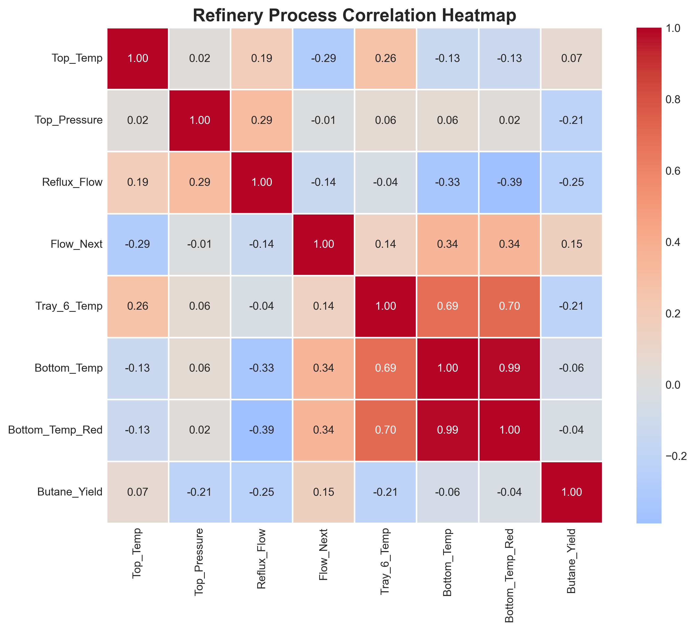
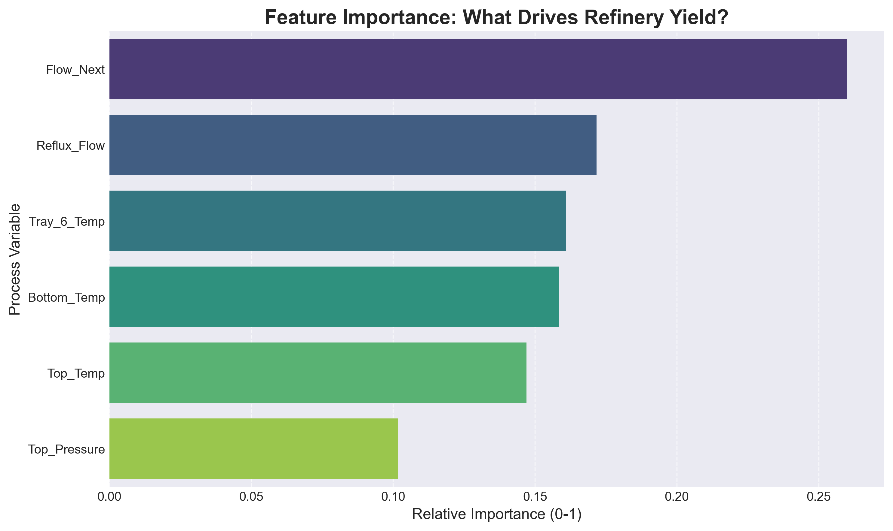
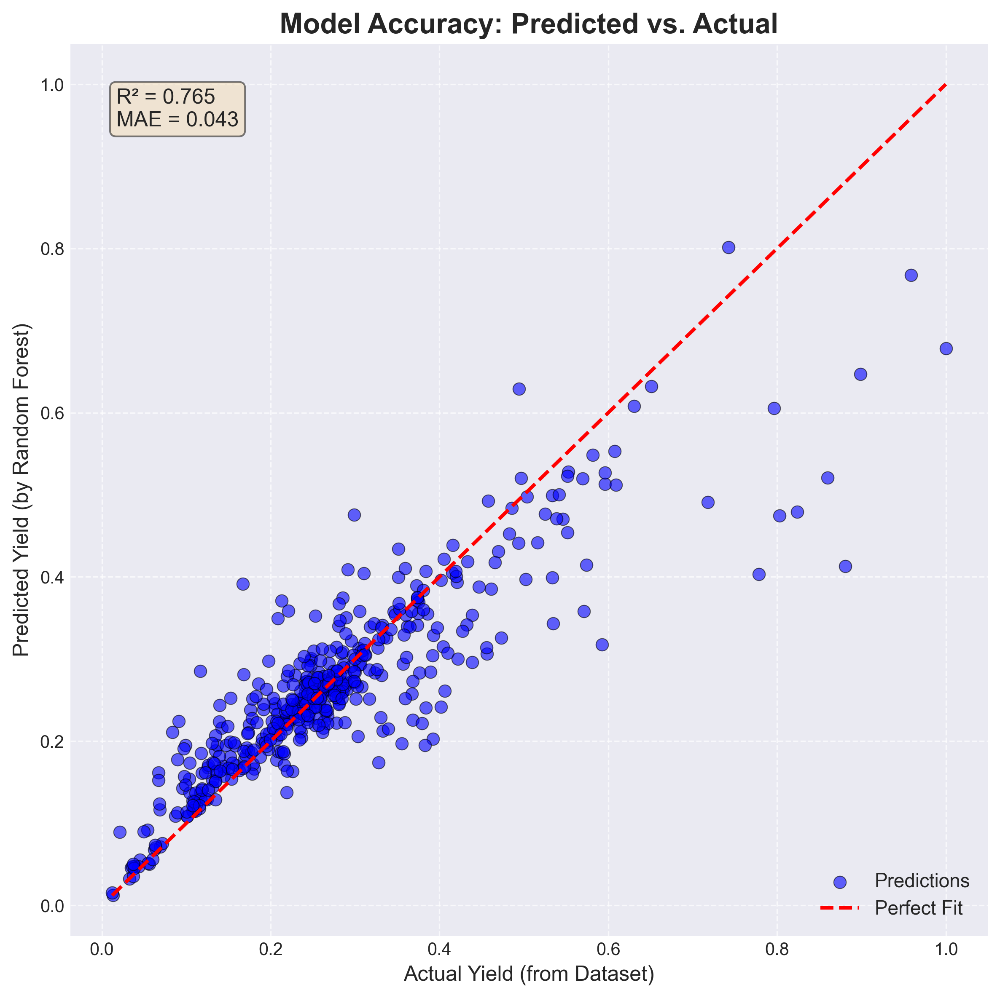
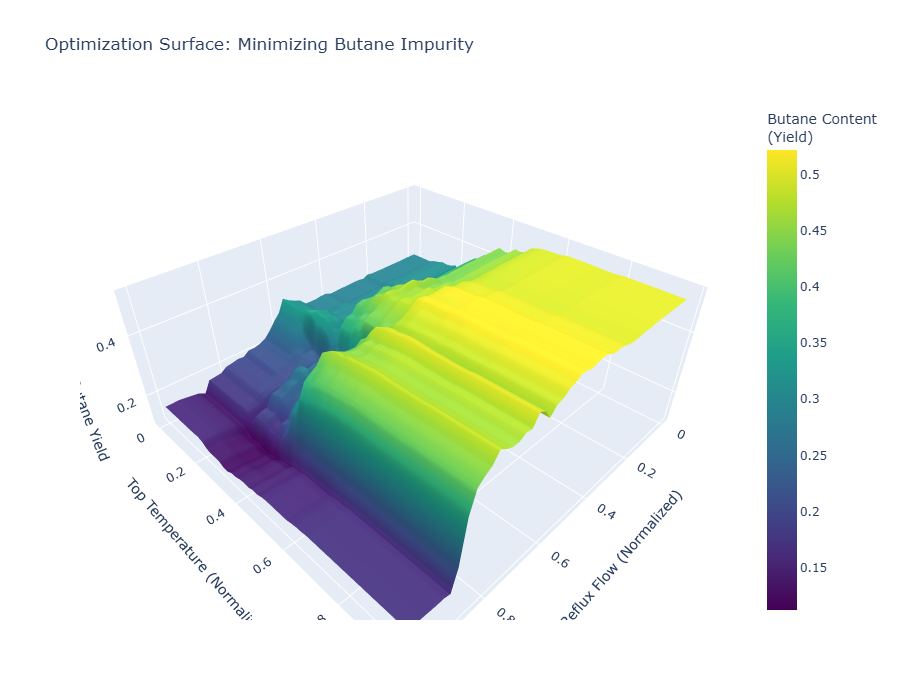

# Refinery Yield Optimization using Machine Learning

[](https://colab.research.google.com/github/Xanderflux/Refinery-Yield-Optimization/blob/main/refinery_optimization.ipynb)


## 🌐 Try It Live

**Try the interactive dashboard now:** [](https://smart-refinery-dashboard.streamlit.app)

🔗 **[https://smart-refinery-dashboard.streamlit.app](https://smart-refinery-dashboard.streamlit.app)**

---

## 📌 Project Overview

This project applies **Machine Learning (Random Forest Regression)** to optimize the product yield of a **Debutanizer Column** in a refinery setting. By analyzing industrial process data, the model predicts butane content (impurity) based on operating parameters like temperature, pressure, and flow rates.

This repository demonstrates the application of **Data-Driven Process Control**, moving beyond linear approximations to capture the complex, non-linear dynamics of chemical separations.

---

## 🏭 Engineering Context

* **Process Unit:** Debutanizer Column (Naphtha Splitter)
* **Objective:** Minimize Butane content in the bottom product to improve quality
* **Key Challenge:** The relationship between Reflux Flow, Temperature, and separation efficiency is highly non-linear and difficult to optimize manually

---

## 🛠️ Methodology

1. **Data Curation:** Utilized a real industrial dataset (Debutanizer Column) with ~2,400 process states
2. **EDA:** Analyzed process correlations; identified `Reflux_Flow` and `Flow_Next` as primary drivers of yield
3. **Modeling:**
   * **Baseline:** Linear Regression (R² ≈ 0.15) - *Failed to capture dynamics*
   * **Champion:** Random Forest Regressor (R² ≈ 0.77) - *Successfully modeled the process*
4. **Optimization:** Generated a 3D Yield Surface to visualize the optimal operating region for minimizing impurities

---

## 📊 Key Results

### Model Performance Comparison

| Model | R² Score | MAE | Interpretation |
|-------|----------|-----|----------------|
| Linear Regression | 0.145 | 0.089 | Poor - Cannot capture non-linear dynamics |
| Random Forest | 0.765 | 0.040 | Excellent - Successfully models complex interactions |

### Feature Importance

The analysis confirmed that **Flow to Next Process** and **Reflux Flow** are the most critical control handles for this unit.

### Visualizations


*Figure 1: Process variable correlation matrix showing relationships between operating parameters.*


*Figure 2: Feature Importance plot confirming the dominant process variables.*


*Figure 3: Model validation showing tight correlation between predictions and actual values.*


*Figure 4: 3D Surface showing the optimal operating region (valley) to minimize butane impurity.*

---

## 💻 Tech Stack

* **Python** - Data Analysis & Modeling
* **Pandas & NumPy** - Process Data Manipulation
* **Scikit-Learn** - Machine Learning (Random Forest, Linear Regression)
* **Plotly & Matplotlib** - Engineering Visualization
* **Seaborn** - Statistical Graphics
* **Jupyter Notebook** - Interactive Development
* **Streamlit** - Interactive Web Dashboard

---

## 🚀 Interactive Dashboard

### 🌐 Online Version

[](https://smart-refinery-dashboard.streamlit.app)

**Try it now:** [https://smart-refinery-dashboard.streamlit.app](https://smart-refinery-dashboard.streamlit.app)

### 💻 Run Locally

Experience the model in action by running the dashboard locally:

```bash
streamlit run app.py
```

**Features:**

* 🎛️ Interactive sliders for all process variables
* 📊 Real-time yield predictions with quality indicators
* 📈 Feature importance visualization
* 🗺️ Interactive 3D optimization surface
* ✅ Model performance metrics

---

## 🚀 How to Run

### Option 1: Run in Google Colab (Recommended)
[](https://colab.research.google.com/github/Xanderflux/Refinery-Yield-Optimization/blob/main/refinery_optimization.ipynb)

Click the badge above to run the notebook directly in your browser - no installation required!

### Option 2: Run Locally

1. **Clone the repository**
   ```bash
   git clone https://github.com/Xanderflux/Refinery-Yield-Optimization.git
   cd Refinery-Yield-Optimization
   ```

2. **Install dependencies**
   ```bash
   pip install -r requirements.txt
   ```

3. **Open Jupyter Notebook**
   ```bash
   jupyter notebook
   ```

4. **Run the analysis**
   Open and execute `refinery_optimization.ipynb`

---

## 📁 Project Structure

```
Refinery-Yield-Optimization/
│
├── data/                           # Dataset files
│   ├── data.csv                    # Cleaned process data
│   ├── data.xlsx                   # Excel format
│   └── data.arff                   # Original ARFF format
│
├── images/                         # Visualization outputs
│   ├── correlation_heatmap.png
│   ├── feature_importance.png
│   ├── actual_vs_predicted.png
│   ├── optimization_surface_3d.png
│   └── optimization_surface_3d.html  # Interactive 3D plot
│
├── refinery_optimization.ipynb     # Main analysis notebook
├── TECHNICAL_REPORT.md            # Detailed engineering analysis
├── data.py                         # Data preprocessing script
├── index.py                        # Original analysis script
├── README.md                       # This file
├── requirements.txt               # Python dependencies
├── .gitignore                     # Git ignore rules
└── LICENSE                        # MIT License
```

---

## 🔬 Key Findings

1. **Non-Linear Process Dynamics:** Linear Regression failed (R² = 0.145), confirming that refinery yield optimization requires advanced machine learning techniques

2. **Critical Process Variables:** 
   - **Flow_Next** (Product draw-off rate) is the dominant variable
   - **Reflux_Flow** is the second most important driver
   - These findings align perfectly with distillation theory

3. **Physics Validation:** The negative correlation between Reflux Flow and Butane impurity matches engineering principles - increasing reflux improves separation efficiency

4. **Optimal Operating Region:** The 3D optimization surface identifies specific Temperature and Reflux Flow setpoints that minimize butane content

---

## 🚧 Future Work

* **Real-time Optimization:** Integration with live process data streams
* **SCADA Integration:** Deploy model for real-time operator guidance
* **Neural Network Comparison:** Evaluate LSTM performance for time-series prediction
* **Multi-Objective Optimization:** Balance yield quality with energy efficiency
* **Uncertainty Quantification:** Add confidence intervals for predictions
* **Advanced Process Control:** Implement Model Predictive Control (MPC)

---

## 👤 Author

**Xanderflux**
* GitHub: [@Xanderflux](https://github.com/Xanderflux)
* Focus: Chemical Engineering + Machine Learning

---

## 📄 License

This project is licensed under the MIT License - see the [LICENSE](LICENSE) file for details.

---

## 🙏 Acknowledgments

* Dataset: Debutanizer Column industrial process data
* Inspiration: Application of machine learning to chemical process optimization
* Tools: Python scientific computing ecosystem

---

## 📚 Technical Documentation

For detailed engineering analysis, model interpretation, and technical FAQ, see [TECHNICAL_REPORT.md](TECHNICAL_REPORT.md).
